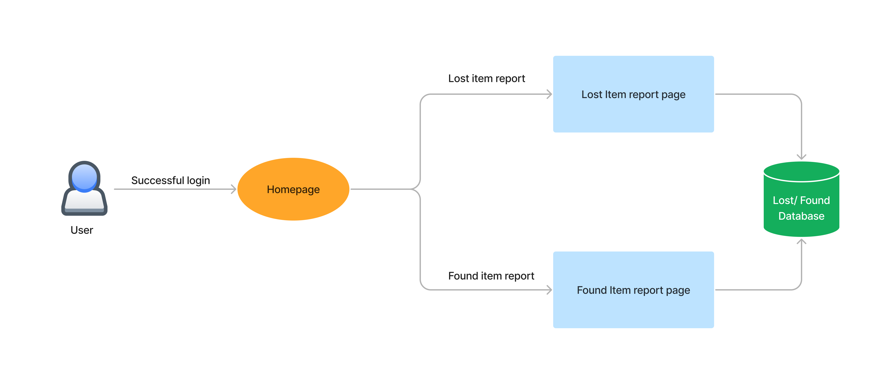
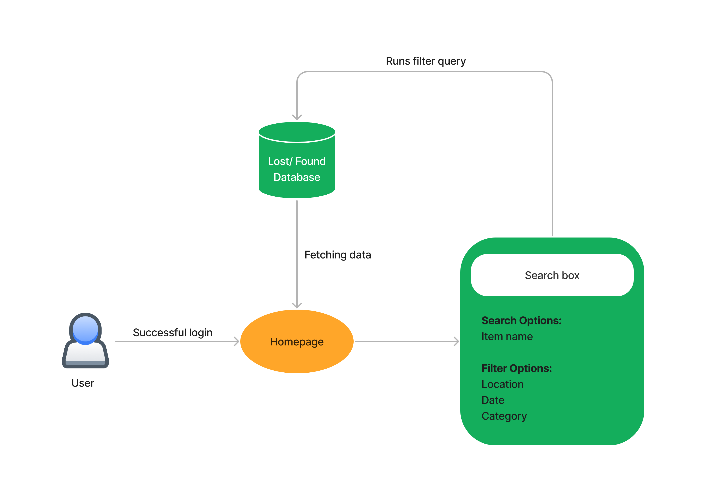

# FindIt - A university-centric lost and found progressive web application

## 1. Introduction

Lovely Professional University is one of India's largest campus univeristies, spanning across 600 acres of land with 30,000+ students, 2000+ faculty members, and 100+ departments. The university has a huge campus with multiple buildings, and it is not physically possible for the university administration to keep track of all the items that are lost on campus. This is where our application comes in. Our application will be a university-centric lost and found progressive web application. This means that users will have to use their university email id to create an account. This will ensure that only students of the university can use the application. The application will also have a feature where users can report lost items to the university administration. This will help the university administration to keep track of the items that are lost on campus.

### 1.1 Purpose

The purpose of this document is to provide a detailed description of the project. This document will be used to create a project proposal for the project. The focus here is on the LPU's non-academic needs. This is a functional description of those features required to address current educational requirements. A short discussion accompanies each requirement, to add the background and framework necessary to explain the functionality. It also describes nonfunctional requirements and other factors necessary to provide a complete and comprehensive description of the requirements for the software.

### 1.2 Scope

This application will be a university-centric lost and found progressive web application. This means that users will have to use their university email id to create an account. This will ensure that only students of the university can use the application. The application will also have a feature where users can report lost items to the university administration. This will help the university administration to keep track of the items that are lost on campus.

### 1.3 Definitions, Acronyms, and Abbreviations

- **LPU**: Lovely Professional University
- **PWA**: Progressive Web Application
- **MERN**: MongoDB, Express.js, React.js, and Node.js
- **SRS**: Software Requirements Specification

### 1.4 References

- [NextJS](https://nextjs.org/)
- [MongoDB](https://www.mongodb.com/)
- [Vercel](https://vercel.com/)
- [GitHub](https://github.com/find-it-LPU/find-It)

## 2. Overall Description

### 2.1 Product Perspective

FindIt is meant to serve as a platform where the lost and found item management of the university can be managed in the most effificent way. Our goal is to make the lives of the students and faculties lives easier by having a one-stop solution for their lost and found needs.

#### 2.1.1 Product Functions

- Users can create an account using their university email id.
- Users can post items they have lost or found.
- Users can see the location of the items posted by other users.
- Users can search for items by category, location, and date.
- Users can report lost items to the university administration.

#### 2.1.2 User Classes and Characteristics

- Students
- University Administration

#### 2.1.3 Operating Environment

- The application will be built using the MERN stack.
- The application will be hosted on Vercel.
- The database will be hosted on MongoDB Atlas.
- For connection between the database and the application, we will be using the Mongoose ODM.
- Since the application will be a PWA, it will be accessible on all devices.

#### 2.1.4 Product Interfaces

- The application will have a web interface.
- The application will also have a mobile interface.

#### 2.1.5 User Documentation

- The application will have a help section where users can find the documentation for the application.

### 2.2 User Needs

Students are the primary users of this application. They will be able to post items they have lost or found. They will also be able to search for items by category, location, and date. 

The administation user will be controlling the categories and locations of the items. They will also be able to see the items that have been reported lost by the students.

### 2.3 Assumptions and Dependencies

This project will be built from scratch. The project will be built using the MERN stack. The project will be hosted on Vercel. The database will be hosted on MongoDB Atlas. The project will be a PWA. The project will be built using NextJS.

### 2.4 Product Functions

#### 2.4.1 Context Diagram

#### 2.4.2 User Case Diagram

#### 2.4.3 Content Posting Diagram

#### 2.4.4 Content Searching Diagram

## 3. System Features and Requirements

### 3.1 Functional Requirements

#### 3.1.1 User Case Scenarios

##### 3.1.1.1 User Case 1: User Registration

**Purpose**: To allow users to create an account.

**User**: Students without an existing account.

**Input Data**: Name, password, and university email id.

**Preconditions**: The user does not have an existing account. The user has a university email id.

**Postconditions**: The user has an account. Necessary information is stored in the database, and local cookies are set.

**Basic Flow**: The user enters the required information and clicks on the register button. The user is redirected to the login page.

**Alternate Flow**: Invalid email, name, or password. The user is shown an error message.

**Business Logic**: This allows user to register an user account.

##### 3.1.1.2 User Case 2: User Login

**Purpose**: To allow users to login to their account.

**User**: Students with an existing account.

**Input Data**: Email and password.

**Preconditions**: The user has an existing account.

**Postconditions**: The user is logged in. Necessary information is stored in the database, and local cookies are set.

**Basic Flow**: The user enters the required information and clicks on the login button. The user is redirected to the home page.

**Alternate Flow**: Invalid email or password. The user is shown an error message.

**Business Logic**: This allows user to login to their account.

##### 3.1.1.3 User Case 3: Posting a Lost Item

**Purpose**: To allow users to post items they have lost.

**User**: Students with an existing account.

**Input Data**: Item name, category, location, and description.

**Preconditions**: The user has an existing account.

**Postconditions**: The item is posted. Necessary information is stored in the database

**Basic Flow**: The user enters the required information and clicks on the post button. The user is redirected to the home page.

**Alternate Flow**: Invalid item name, category, location, or description. The user is shown an error message.

**Business Logic**: This allows user to post items they have lost.

##### 3.1.1.4 User Case 4: Posting a Found Item

**Purpose**: To allow users to post items they have found.

**User**: Students with an existing account.

**Input Data**: Item name, category, location, and description.

**Preconditions**: The user has an existing account.

**Postconditions**: The item is posted. Necessary information is stored in the database

**Basic Flow**: The user enters the required information and clicks on the post button. The user is redirected to the home page.

**Alternate Flow**: Invalid item name, category, location, or description. The user is shown an error message.

**Business Logic**: This allows user to post items they have found.

##### 3.1.1.5 User Case 5: Searching for Items

**Purpose**: To allow users to search for items.

**User**: Students with an existing account.

**Input Data**: Item name, category, location, and date.

**Preconditions**: The user has an existing account.

**Postconditions**: The items are displayed. Necessary information is fetched from the database.

**Basic Flow**: The user enters the required information and clicks on the search button. The items are displayed.

**Alternate Flow**: Invalid item name, category, location, or date. The user is shown an error message.

**Business Logic**: This allows user to search for items.

##### 3.1.1.6 User Case 6: User Logout

**Purpose**: To allow users to logout of their account.

**User**: Students with an existing account.

**Input Data**: None.

**Preconditions**: The user has an existing account.

**Postconditions**: The user is logged out. Necessary information is removed from the database, and local cookies are removed.

**Basic Flow**: The user clicks on the logout button. The user is redirected to the login page.

**Alternate Flow**: None.

**Business Logic**: This allows user to logout of their account.

